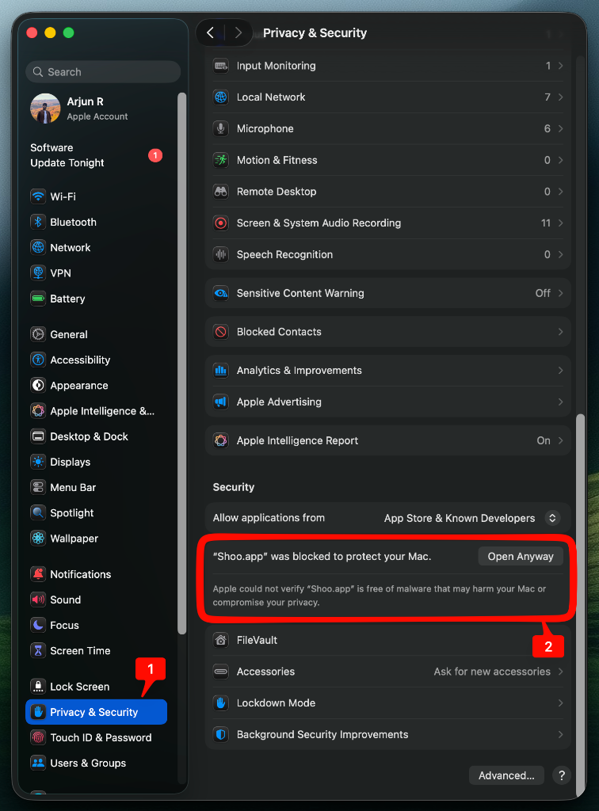

# Shoo 🚥

Shoo is a minimalist macOS menu bar utility that gives you full control over your windows directly from **Mission Control**.

Normally, Mission Control only lets you switch windows. Shoo adds interactive "traffic light" buttons (Close and Minimize) to every window in Mission Control, allowing you to clean up your workspace without leaving the overview.

## Features

- **Interactive Controls:** Close and Minimize buttons on every window in Mission Control.
- **Keyboard Shortcuts** while hovering over windows in Mission Control:
  - `Cmd + W` — Close Window
  - `Cmd + M` — Minimize Window
  - `Cmd + Q` — Quit Application
- **Guided Onboarding** for Accessibility permissions.
- **Auto-Updates** — checks for new versions automatically.
- **Safe Permission Handling** — gracefully handles permission revocation without system hangs.

## Installation

1. **Download** the latest `Shoo.dmg` from the [Releases](https://github.com/AR-1106/Shoo/releases) page.
2. **Open** the DMG and drag `Shoo.app` into your **Applications** folder.

### ⚠️ How to Open (First Time Only)
Because Shoo is a direct distribution (not App Store), macOS will block it on the first double-click. To bypass this:

1. **Try to open** `Shoo.app` (you will see a "cannot verify" error). Click **Done**.
2. Open **System Settings** → **Privacy & Security**.
3. Scroll down to the **Security** section.
4. Click **Open Anyway** next to the message about Shoo.app.

5. A final popup will appear—click **Open** to confirm.

*You only have to do this once. After the first time, it will open normally with a double-click.*

## Updating
Use **Check for Updates** from the menu bar icon inside the app to update automatically.

## Permissions
Shoo requires **Accessibility Access** to interact with windows. On launch, Shoo will guide you through enabling this in:
`System Settings` → `Privacy & Security` → `Accessibility`.

## Requirements
- macOS 13.0 (Ventura) or later.

## License
MIT License. See [LICENSE](LICENSE) for details.
